# WorkForcePro – Test Execution Log

## UI Test Execution Summary

| Field | Value |
|-------|-------|
| **Execution Date** | June 25, 2026 |
| **Tester** | Subash Acharya |
| **Environment** | Localhost (Backend: 3001, Frontend: 3000) |
| **Build Version** | v1.0.0 |
| **Total UI Test Cases** | 25 |
| **Passed** | 17 |
| **Failed** | 6 |
| **N/A** | 2 |
| **UI Pass Rate** | 68% |

---

## Detailed UI Execution Log

| Test Case ID | Result | Notes | Defect ID |
|--------------|--------|-------|-----------|
| TC-001 | ✅ PASS | Employee created successfully with ID EMP999.    | - |
| TC-002 | ✅ PASS | Proper validation errors shown. 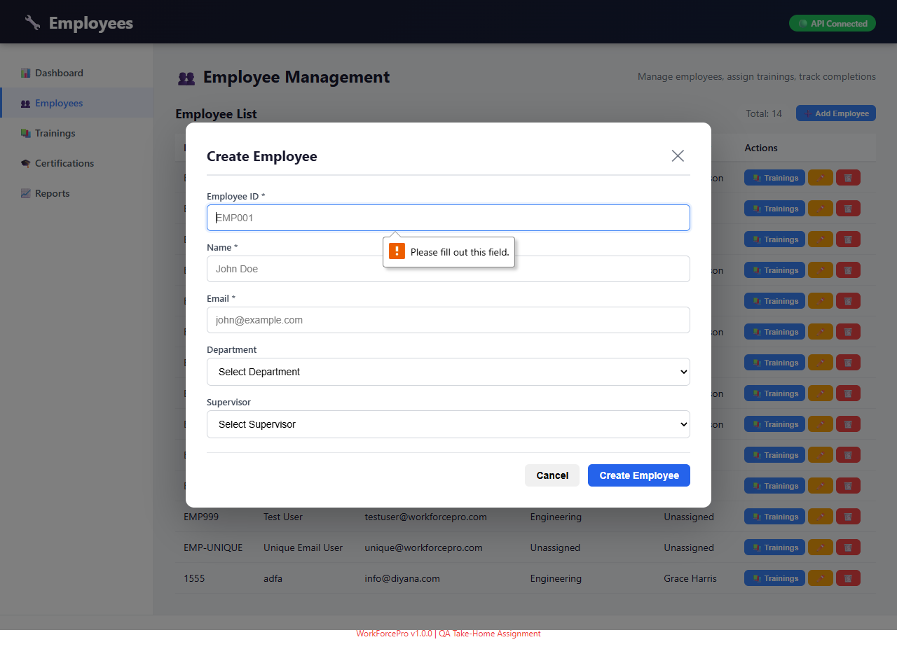 | - |
| TC-003 | ❌ FAIL | Duplicate email blocked by database but returns 500 error. 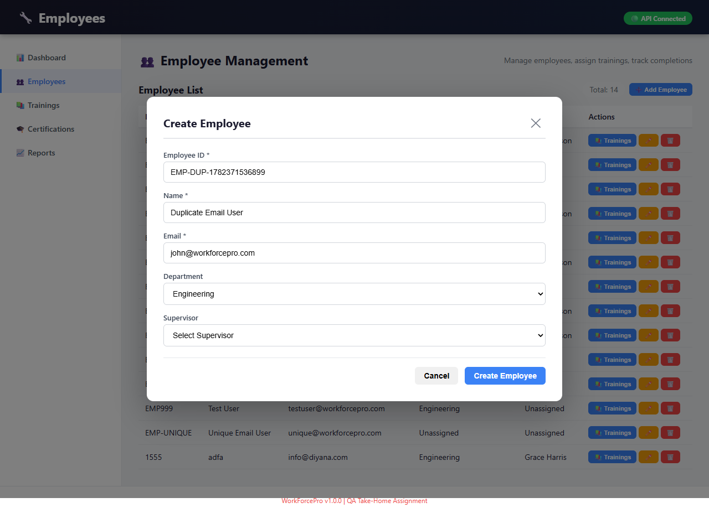  | DEF-001, DEF-006 |
| TC-004 | ✅ PASS | Unique email accepted. 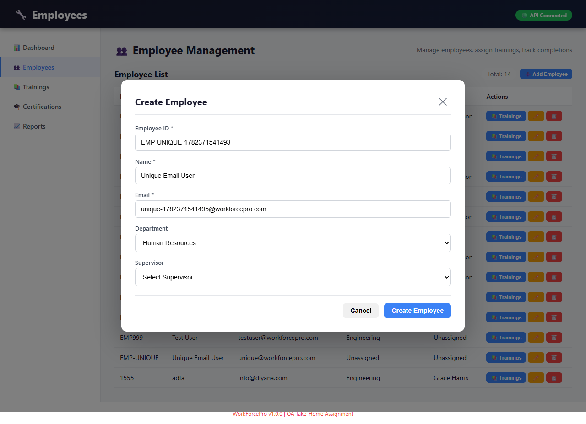  | - |
| TC-005 | ✅ PASS | Duplicate Employee ID blocked with proper error. 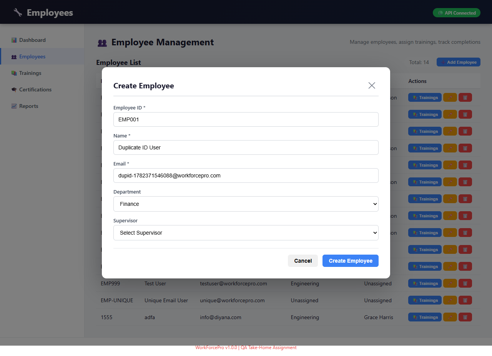 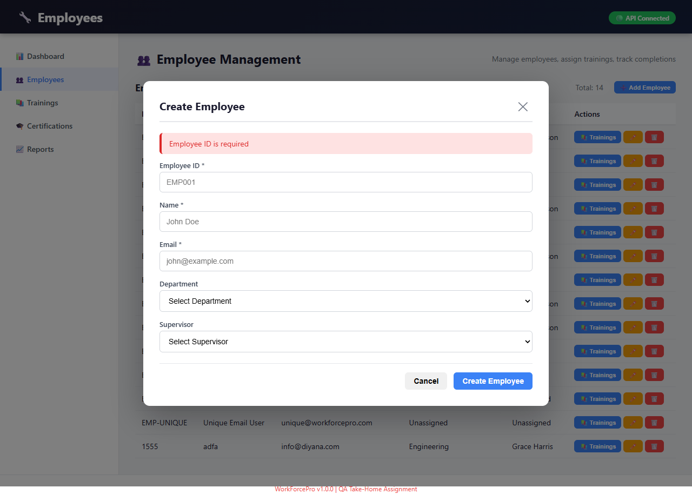 | - (Fixed) |
| TC-006 | ✅ PASS | Training assigned successfully from list.  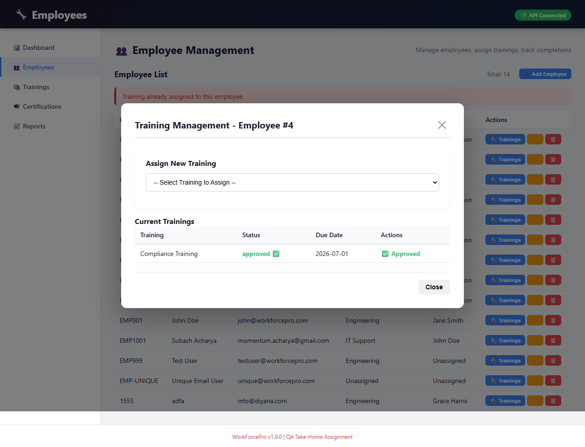 | - |
| TC-007 | ⚠️ N/A | UI updated: Training can only be assigned after selecting an employee. | - |
| TC-008 | ✅ PASS | Training marked as completed.  | - |
| TC-009 | ⚠️ N/A | UI updated: Cannot complete unassigned training directly. | - |
| TC-010 | ✅ PASS | Completed training approved. 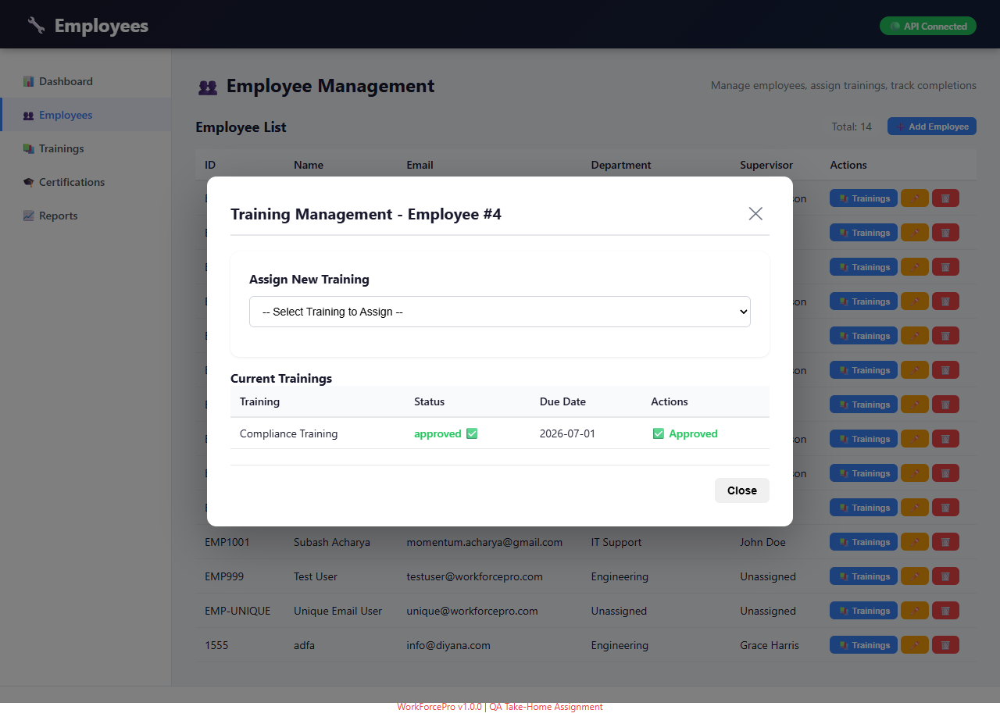 | - |
| TC-011 | ❌ FAIL | Uncompleted training approved. No validation error shown.  | DEF-003 |
| TC-012 | ❌ FAIL | Self-approval allowed.  | DEF-003 |
| TC-013 | ✅ PASS | Certification list loads correctly.  | - |
| TC-014 | ❌ FAIL | No "Add Certification" button exists on the page. 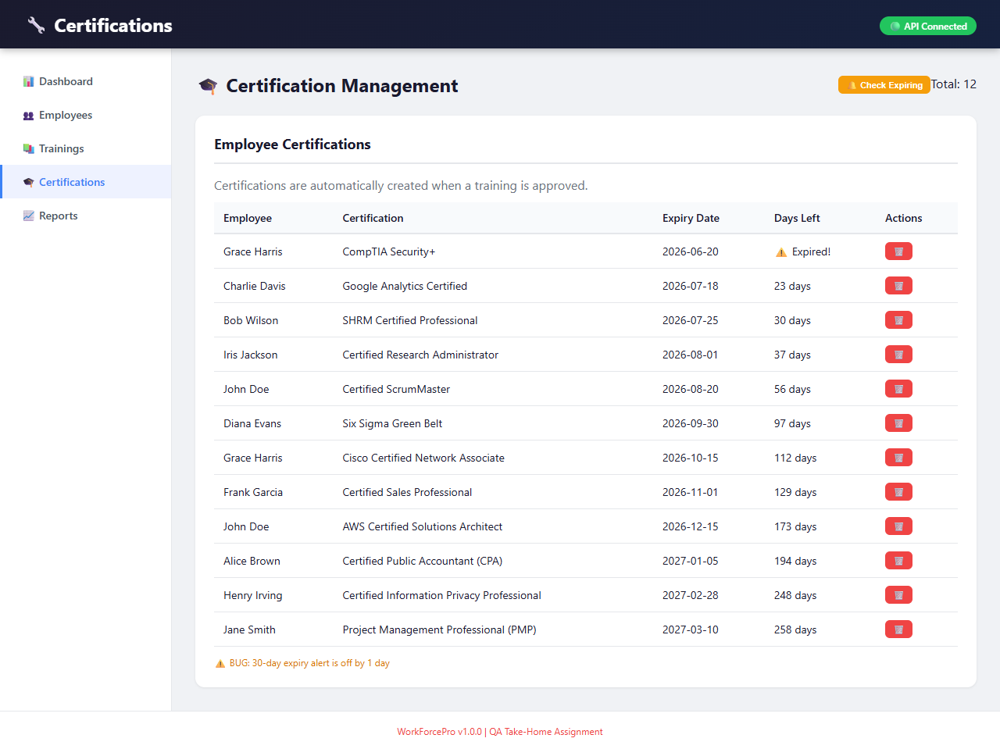 | DEF-010 |
| TC-015 | ❌ FAIL | 30-day expiry NOT shown in expiring list.  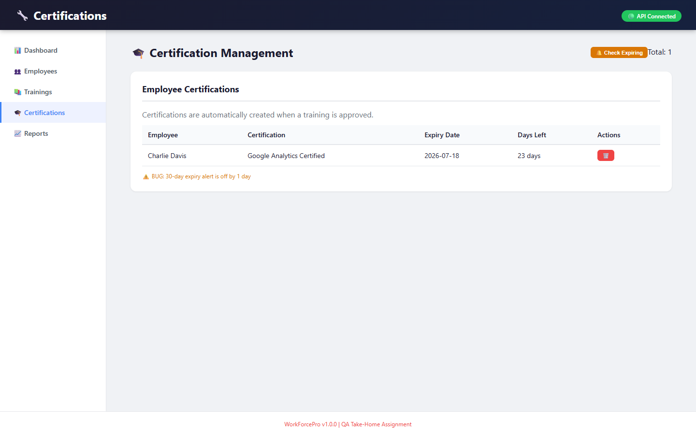 | DEF-004 |
| TC-016 | ❌ FAIL | Expiry calculation incorrect (off-by-one).   | DEF-004 |
| TC-017 | ✅ PASS | All menu items load correctly.  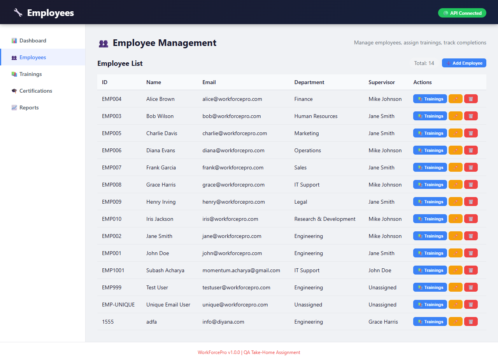 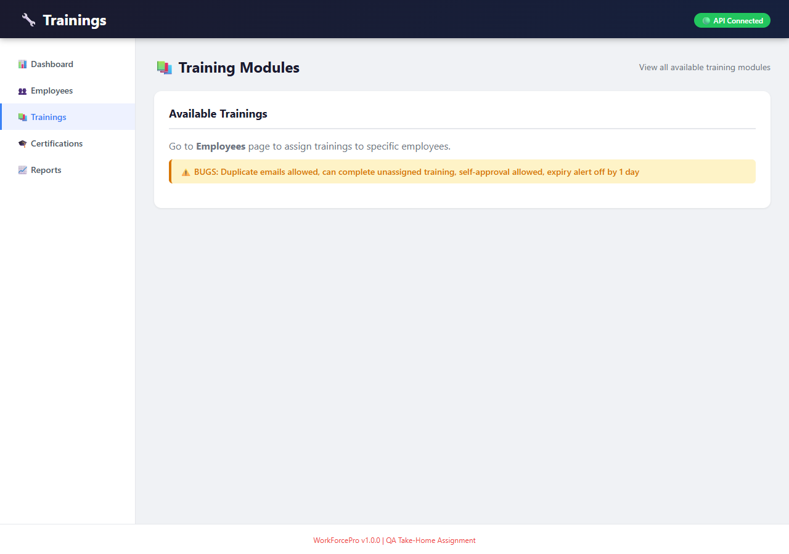  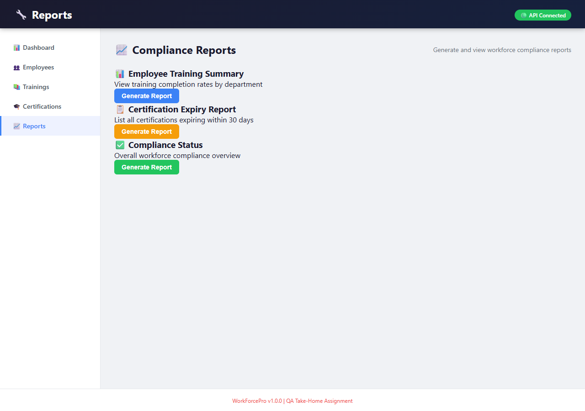 | - |
| TC-018 | ✅ PASS | Page refresh works without errors.  | - |
| TC-019 | ✅ PASS | Modals close properly. 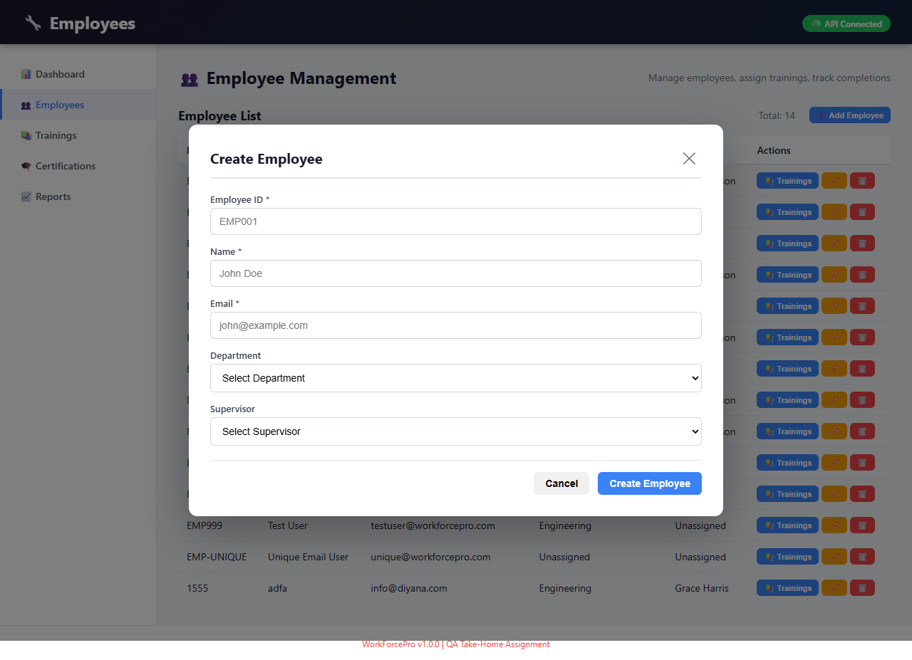  | - |
| TC-020 | ✅ PASS | Dashboard loads with stats visible. 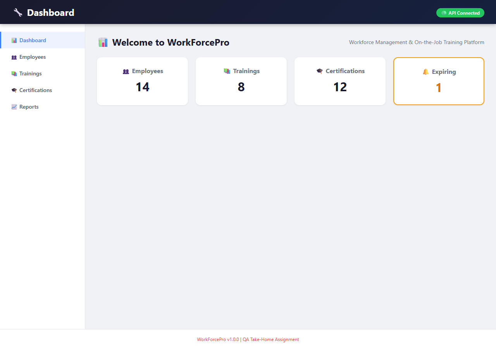 | - |
| TC-021 | ✅ PASS | Employee count matches database (10).  | - |
| TC-022 | ✅ PASS | Training count matches database (8).  | - |
| TC-023 | ✅ PASS | Certification count matches database (12).  | - |
| TC-024 | ✅ PASS | Expiring certifications shown in alert card.  | - |
| TC-025 | ✅ PASS | Dashboard updates after data change.  | - |
| TC-026 | ❌ FAIL | Training list page does not show all trainings (stub page). | DEF-007 |
| TC-027 | ❌ FAIL | Approved training did not create certification. | DEF-008 |
| TC-028 | ❌ FAIL | No certification creation option after approval. | DEF-009 |

---

## API Test Execution Summary

| Field | Value |
|-------|-------|
| **Total API Test Cases** | 5 |
| **Passed** | 0 |
| **Failed** | 5 |
| **Pending** | 0 |
| **API Pass Rate** | 0% |

---

## Detailed API Execution Log

| Test Case ID | Result | Notes | Defect ID |
|--------------|--------|-------|-----------|
| TC-API-001 | ❌ FAIL | Complete Unassigned Training via API - returned 201 with warning | DEF-002 |
| TC-API-002 | ❌ FAIL | Approve Uncompleted Training via API - returned 200, approved without completion | DEF-003 |
| TC-API-003 | ❌ FAIL | Self-Approval via API - returned 200, self-approval succeeded | DEF-003 |
| TC-API-004 | ❌ FAIL | Duplicate Email via API - returned 500 instead of 400 | DEF-001 |
| TC-API-005 | ❌ FAIL | Duplicate Employee ID via API - returned 500 instead of 400 | DEF-005 |
