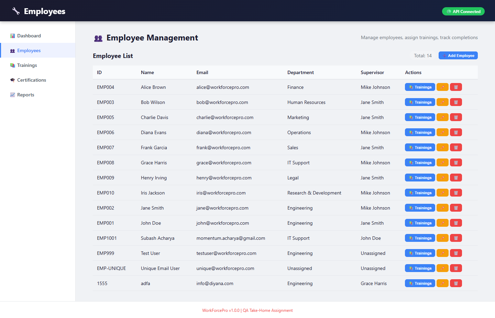
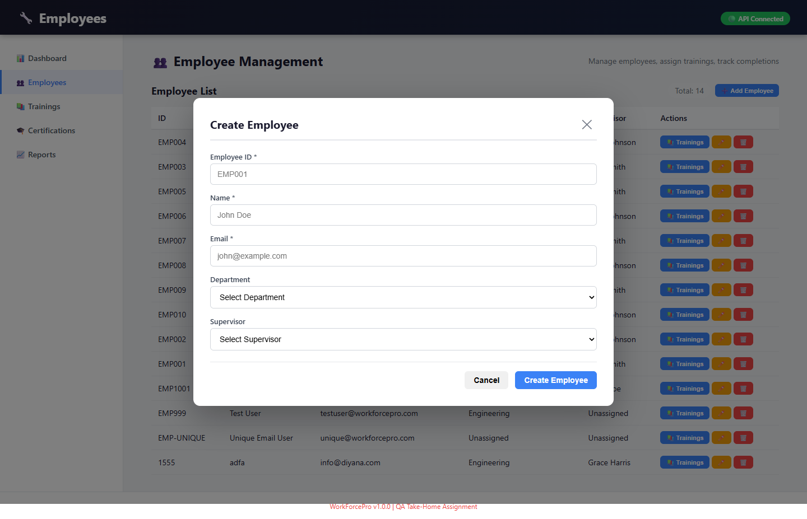
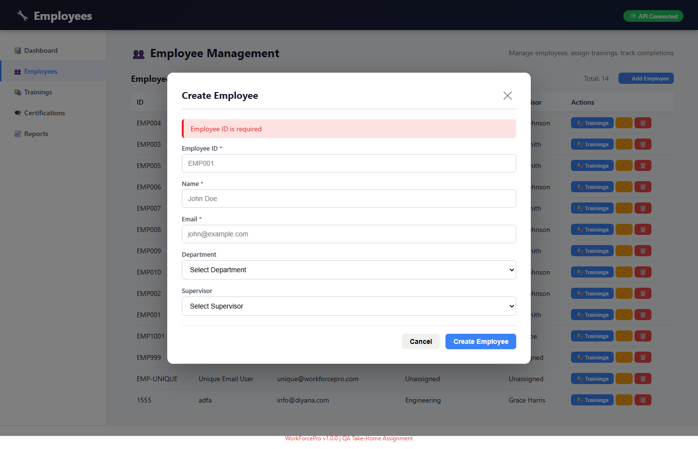

# WorkForcePro – Test Summary Report

## 1.0 Executive Summary

| Field | Value |
|-------|-------|
| **Report Date** | June 25, 2026 |
| **Prepared By** | Subash Acharya |
| **Application** | WorkForcePro v1.0.0 |
| **Testing Period** | June 25, 2026 |

### Key Findings
- **Total UI Test Cases:** 31
- **UI Passed:** 19
- **UI Failed:** 9
- **UI N/A:** 3
- **UI Pass Rate:** 61%
- **Total API Test Cases:** 5
- **API Passed:** 0
- **API Failed:** 5
- **API Pass Rate:** 0%
- **Critical Bugs Found:** 1 (DEF-002)
- **Major Bugs Found:** 4 (DEF-005, DEF-007, DEF-008, DEF-010, DEF-011)
- **Security Bugs Found:** 1 (DEF-003)
- **Medium Bugs Found:** 1 (DEF-009)
- **Minor Bugs Found:** 3 (DEF-001, DEF-004, DEF-006)

### 2.1 UI Test Results by Module

| Module | Total Tests | Passed | Failed | N/A | Pass Rate |
|--------|-------------|--------|--------|-----|-----------|
| Employee Management | 5 | 3 | 2 | 0 | 60% |
| Training Management | 7 | 3 | 2 | 2 | 43% |
| Certification Management | 8 | 2 | 6 | 0 | 25% |
| Dashboard | 6 | 6 | 0 | 0 | 100% |
| UI/UX | 3 | 3 | 0 | 0 | 100% |
| Training List | 2 | 0 | 2 | 0 | 0% |
| End-to-End Workflow | 2 | 1 | 1 | 0 | 50% |
| **Total UI** | **31** | **19** | **9** | **3** | **61%** |

### 2.2 Bug Distribution

| Severity | Count | Defects |
|----------|-------|---------|
| Critical | 1 | DEF-002 |
| Major | 4 | DEF-005, DEF-007, DEF-008, DEF-010, DEF-011 |
| Security | 1 | DEF-003 |
| Medium | 1 | DEF-009 |
| Minor | 3 | DEF-001, DEF-004, DEF-006 |
| **Total** | **10** | |

## 3.0 Defects Found

| Defect ID | Title | Severity | Priority | Status | Screenshot |
|-----------|-------|----------|----------|--------|------------|
| DEF-001 | Duplicate Email - Poor Error Handling | Minor | Medium | Open |   |
| DEF-002 | Can Complete Unassigned Training | Critical | High | Open |   |
| DEF-003 | Self-Approval Allowed | Security | High | Open |   |
| DEF-004 | Expiration Alert Off by 30 Days | Minor | Medium | Open |  |
| DEF-005 | Employee ID Uniqueness - Poor Error Handling | Major | High | Open |  |
| DEF-006 | Frontend Generic Error for Duplicate Email | Minor | Low | Open |   |
| DEF-007 | Training List Page Not Showing All Trainings | Major | High | Open | - |
| DEF-008 | Certification Not Created After Training Approval | Major | High | Open | - |
| DEF-009 | No Certification Option After Training Approval | Medium | Medium | Open | - |
| DEF-010 | No UI Option to Create Certification Manually | Major | High | Open | - |
| DEF-011 | Approved Trainings Not Listed in Certifications | Major | High | Open | - |

---

## 4.0 Recommendations

### 4.1 Critical Actions (Immediate)
1. **DEF-002** - Fix backend to prevent completing unassigned training (API vulnerability)
2. **DEF-003** - Fix self-approval and completion checks (Security issue)
3. **DEF-005** - Fix employee ID error handling (Major UX issue)

### 4.2 Medium Priority Actions
1. **DEF-001** - Fix duplicate email error handling
2. **DEF-004** - Fix expiry date calculation

### 4.3 Testing Recommendations
1. **Regression Testing** - After fixes, retest all affected areas
2. **SQL Queries** - Validate database queries for completeness
3. **Accessibility Testing** - Perform and document accessibility audit

---

## 5.0 Test Environment Details

| Component | Details |
|-----------|---------|
| Backend | Node.js v24.0.2, Express, SQLite |
| Frontend | React 18, Axios |
| Database | SQLite (workforcepro.db) |
| Browser | Google Chrome |
| OS | Windows 10 |

---

## 6.0 Approval

| Role | Name | Date | Signature |
|------|------|------|-----------|
| QA Engineer | Subash Acharya | June 25, 2026 | |
