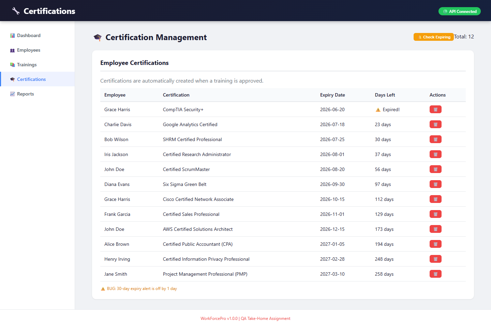

# WorkForcePro – Defect Reports

## Defect Summary

| Defect ID | Title | Severity | Priority | Status | Test Cases |
|-----------|-------|----------|----------|--------|------------|
| DEF-001 | Duplicate Email - Poor Error Handling (500 instead of 400) | Minor | Medium | Open | TC-003, TC-API-004 |
| DEF-002 | Can Complete Unassigned Training | Critical | High | Open | TC-API-001 |
| DEF-003 | Self-Approval / Approve Uncompleted Training Allowed | Security | High | Open | TC-012, TC-API-002, TC-API-003 |
| DEF-004 | Expiration Alert Off by 30 Days | Minor | Medium | Open | TC-015, TC-016 |
| DEF-005 | Duplicate Employee ID - Poor Error Handling (500 instead of 400) | Major | High | Open | TC-005, TC-API-005 |
| DEF-006 | Frontend Shows Generic Error for Duplicate Email | Minor | Low | Open | TC-003 |
| DEF-007 | Training List Page Not Showing All Trainings | Major | High | Open | TC-026 |
| DEF-008 | Certification Not Created After Training Approval | Major | High | Open | TC-027 |
| DEF-009 | No Certification Option After Training Approval | Medium | Medium | Open | TC-028 |
| DEF-010 | No UI Option to Create Certification Manually | Major | High | Open | TC-014 |
| DEF-011 | Approved Trainings Not Listed in Certifications | Major | High | Open | TC-029 |
| DEF-012 | Delete Employee Returns 500 Error | Major | High | Open | API-UT-010 |
| DEF-013 | PUT /api/employees/:id Overwrites is_supervisor to 0 | Major | High | Open | API-UT-009 |

---

## DEF-001: Duplicate Email - Poor Error Handling

| Field | Value |
|-------|-------|
| **Defect ID** | DEF-001 |
| **Title** | Duplicate Email - Poor Error Handling (500 instead of 400) |
| **Test Cases** | TC-003, TC-API-004 |
| **Severity** | Minor |
| **Priority** | Medium |
| **Reported By** | Subash Acharya |
| **Date Found** | June 25, 2026 |
| **Environment** | Localhost |
| **Module** | Employee Management |

### Description

When attempting to create an employee with an email that already exists in the system, the backend returns a `500 Internal Server Error` instead of a proper `400 Bad Request` with a clear error message. The database correctly enforces unique emails via a `UNIQUE` constraint, but the error is not handled gracefully.

### Steps to Reproduce

1. Navigate to the Employees page
2. Click "Add Employee" button
3. Fill all fields with valid data using an email that already exists (e.g., `john@workforcepro.com`)
4. Click "Create Employee"
5. Observe the error response in browser console / network tab

### Expected Result

- Status code: `400 Bad Request`
- Response body: `{ "error": "Email already exists" }`
- User sees a clear error message: "Email already exists"

### Actual Result

- Status code: `500 Internal Server Error`
- Response body: `{ "error": "Failed to create employee" }`
- User sees generic error: "Failed to create employee"

### Impact

- Users don't understand why creation failed
- Poor user experience
- Could lead to support tickets
- No clear feedback for corrective action

### Root Cause

The backend tries to insert the employee and fails at the database level (`SQLITE_CONSTRAINT`), but the error isn't caught and handled properly. The error propagates as a 500 server error.

### Screenshot

 

### Suggested Fix

In `backend/routes/employees.js`, catch the constraint error and return a proper 400 response:

```javascript
try {
  // insert employee
} catch (error) {
  if (error.message.includes('UNIQUE constraint failed')) {
    return res.status(400).json({ error: 'Email already exists' });
  }
  return res.status(500).json({ error: 'Failed to create employee' });
}
```

---

## DEF-002: Can Complete Unassigned Training

| Field | Value |
|-------|-------|
| **Defect ID** | DEF-002 |
| **Title** | Can Complete Unassigned Training |
| **Test Cases** | TC-API-001 |
| **Severity** | Critical |
| **Priority** | High |
| **Reported By** | Subash Acharya |
| **Date Found** | June 25, 2026 |
| **Environment** | Localhost |
| **Module** | Training Management |

### Description

The backend API allows completing a training that was never assigned to an employee. The UI prevents this action, but the API vulnerability remains, allowing malicious or accidental completion of unassigned trainings.

### Steps to Reproduce

1. Identify an employee who has NOT been assigned a specific training
2. Send POST request to `/api/trainings/complete`
3. Body: `{ "employee_id": 123, "training_id": 456, "notes": "API test" }`
4. Observe the response

### Expected Result

- Status code: `400 Bad Request`
- Response: `{ "error": "Training not assigned to this employee" }`
- Training should NOT be marked as completed

### Actual Result

- Status code: `201 Created` or `200 OK`
- Training is marked as "completed"
- Response includes warning: "Training was not assigned but was completed anyway"

### Impact

- Invalid training completion records
- Cannot trust training completion data
- Compliance issues
- Data integrity problems

### Root Cause

The `POST /api/trainings/complete` endpoint creates a new record if one doesn't exist, instead of rejecting the request.

### Screenshot

 

### Suggested Fix

Check if training is assigned before allowing completion:

```javascript
const record = employeeTrainings.find(
  et => et.training_id === training_id && et.employee_id === employee_id
);
if (!record) {
  return res.status(400).json({ error: 'Training not assigned to this employee' });
}
```

---

## DEF-003: Self-Approval Allowed

| Field | Value |
|-------|-------|
| **Defect ID** | DEF-003 |
| **Title** | Self-Approval Allowed |
| **Test Cases** | TC-012, TC-API-002, TC-API-003 |
| **Severity** | Security |
| **Priority** | High |
| **Reported By** | Subash Acharya |
| **Date Found** | June 25, 2026 |
| **Environment** | Localhost |
| **Module** | Training Management |

### Description

Employees can approve their own training (self-approval). The UI has been updated to prevent approving uncompleted training (only shows "Complete" button), but self-approval is still possible after completion. This violates the segregation of duties principle.

### Steps to Reproduce (UI)

1. Assign training to an employee who is also a supervisor (e.g., Jane Smith)
2. Complete the training
3. Click "Approve" on own training
4. Observe the approval is successful

### Steps to Reproduce (API)

1. Send POST request to `/api/trainings/approve`
2. Body: `{ "employee_id": 123, "training_id": 456, "supervisor_id": 123 }`
3. Observe the response

### Expected Result

- Status code: `400 Bad Request`
- Error: "Cannot approve your own training"
- Training should NOT be approved

### Actual Result

- Status code: `200 OK`
- Training is approved successfully
- No error message shown

### Impact

- Security vulnerability
- Invalid training approvals
- Compliance risk
- No segregation of duties

### Root Cause

The `POST /api/trainings/approve` endpoint does not check if `supervisor_id` equals `employee_id`.

### Screenshot


### Suggested Fix

Add validation check:

```javascript
if (supervisor_id && parseInt(supervisor_id) === parseInt(employee_id)) {
  return res.status(400).json({ error: 'Cannot approve your own training' });
}
```

---

## DEF-004: Expiration Alert Off by 30 Days

| Field | Value |
|-------|-------|
| **Defect ID** | DEF-004 |
| **Title** | Expiration Alert Off by 30 Days |
| **Test Cases** | TC-015, TC-016 |
| **Severity** | Minor |
| **Priority** | Medium |
| **Reported By** | Subash Acharya |
| **Date Found** | June 25, 2026 |
| **Environment** | Localhost |
| **Module** | Certification Management |

### Description

The certification expiration alert has an off-by-one error. Certifications expiring exactly at 30 days are NOT shown in the expiring list. Only certifications with 29 days or fewer appear. This means users miss important expiry alerts.

### Steps to Reproduce

1. Create a certification with expiry date = TODAY + 30 days
2. Click "Check Expiring" on the Certifications page
3. Observe that the 30-day certification does NOT appear
4. Create a certification with expiry date = TODAY + 29 days
5. Click "Check Expiring" again
6. Observe that the 29-day certification DOES appear

### Expected Result

Certifications expiring within 30 days (including exactly 30 days) should appear in the expiring list. 30-day certification should be visible.

### Actual Result

Certifications with 29 days or fewer appear. 30-day certifications do NOT appear.

### Impact

- Users miss important expiry alerts
- Could lead to expired certifications going unnoticed
- Compliance issues

### Root Cause

Off-by-one error in SQL query: uses `< 30` instead of `<= 30`.

### Screenshot



### Suggested Fix

Change the condition to include 30 days:

```sql
WHERE expiry_date BETWEEN ? AND ?
  AND CAST(julianday(expiry_date) - julianday(?) AS INTEGER) <= 30
```

---

## DEF-006: Frontend Shows Generic Error for Duplicate Email

| Field | Value |
|-------|-------|
| **Defect ID** | DEF-006 |
| **Title** | Frontend Shows Generic Error for Duplicate Email |
| **Test Cases** | TC-003 |
| **Severity** | Minor |
| **Priority** | Low |
| **Reported By** | Subash Acharya |
| **Date Found** | June 25, 2026 |
| **Environment** | Localhost |
| **Module** | Frontend - Employee Management |

### Description

When a duplicate email is blocked by the backend, the frontend displays the generic message "Failed to create employee" instead of a meaningful error. This is a UX issue that confuses users.

### Steps to Reproduce

1. Create an employee with email `test@test.com` (successful)
2. Try to create another employee with same email `test@test.com`
3. Observe the error message displayed on the UI

### Expected Result

- User sees clear message: "Email already exists"
- Error message is specific and helpful

### Actual Result

- User sees generic error: "Failed to create employee"
- No indication of what went wrong

### Impact

- Users don't know what went wrong
- Cannot recover without trial and error
- Poor user experience

### Root Cause

The frontend does not handle the specific error response and shows a generic fallback message.

### Screenshot

 

### Suggested Fix

1. Backend: Return proper 400 error with message (see DEF-001)
2. Frontend: Update the EmployeeModal component to display the specific error message from the backend response

---

## DEF-007: Training List Page Not Showing All Trainings

| Field | Value |
|-------|-------|
| **Defect ID** | DEF-007 |
| **Title** | Training List Page Not Showing All Trainings |
| **Test Cases** | TC-026 |
| **Severity** | Major |
| **Priority** | High |
| **Reported By** | Subash Acharya |
| **Date Found** | June 25, 2026 |
| **Environment** | Localhost |
| **Module** | Frontend - Training Management |

### Description

The `/trainings` page is not displaying the full list of available training modules. Some trainings that exist in the database are not visible on the page, making it difficult to manage training assignments.

### Steps to Reproduce

1. Navigate to `http://localhost:3000/trainings`
2. Observe the training list
3. Compare with the database to verify all trainings are present

### Expected Result

All training modules should be listed with their details (ID, Name, Description).

### Actual Result

Training list is empty or incomplete. Some trainings are missing.

### Impact

- Difficult to manage training assignments
- Poor user experience
- Cannot verify available trainings
- Users may not know what trainings exist

### Root Cause

Likely an issue with the API call or frontend rendering. The API may not be returning all trainings, or the frontend may not be rendering them correctly.

### Suggested Fix

1. Check the API call to `/api/trainings` and ensure it returns all records
2. Verify the frontend renders all returned trainings
3. Check for any filtering or pagination issues

---

## DEF-008: Certification Not Created After Training Approval

| Field | Value |
|-------|-------|
| **Defect ID** | DEF-008 |
| **Title** | Certification Not Automatically Created After Training Approval |
| **Test Cases** | TC-027 |
| **Severity** | Major |
| **Priority** | High |
| **Reported By** | Subash Acharya |
| **Date Found** | June 25, 2026 |
| **Environment** | Localhost |
| **Module** | Certification Management |

### Description

When a training is approved, the system should automatically create a certification for the employee. Currently, this does not happen, and there is no manual option to create a certification from an approved training. This breaks the training-to-certification workflow.

### Steps to Reproduce

1. Create an employee
2. Assign a training to the employee
3. Complete the training (status changes to "completed")
4. Approve the training (status changes to "approved")
5. Navigate to the Certifications page
6. Look for a certification for the employee

### Expected Result

A certification should automatically appear in the certifications list for the employee.

### Actual Result

No certification is created for the employee. The approved training does not generate a certification.

### Impact

- Users don't receive certifications for completed trainings
- Training completion cannot be verified
- Missing compliance documentation
- Incomplete workflow

### Root Cause

Missing auto-certification logic in the training approval endpoint, or the frontend does not trigger certification creation.

### Suggested Fix

- Option A: Auto-create certification when training status changes to "approved"
- Option B: Add a "Create Certification" button that appears after approval
- Option C: Add a background job that processes approved trainings and creates certifications

---

## DEF-009: No Certification Option After Training Approval

| Field | Value |
|-------|-------|
| **Defect ID** | DEF-009 |
| **Title** | No Certification Option After Training Approval |
| **Test Cases** | TC-028 |
| **Severity** | Medium |
| **Priority** | Medium |
| **Reported By** | Subash Acharya |
| **Date Found** | June 25, 2026 |
| **Environment** | Localhost |
| **Module** | UI - Training Management |

### Description

After a training is approved, the training page only shows "✅ Approved" text with no further actions available. There is no button, link, or automatic process to create a certification from the approved training.

### Steps to Reproduce

1. Complete the full training flow:
   - Assign training to employee
   - Complete training
   - Approve training
2. Observe the approved training row on the Training page
3. Look for any certification-related action (button, link, auto-creation)

### Expected Result

Either:
- Certification is auto-created on approval (preferred), OR
- A button/link is available to manually create a certification from the approved training

### Actual Result

After approval, the row shows "✅ Approved" with no further actions. No certification is created, and no manual option exists on the training page.

### Impact

- Users cannot get certifications through the training workflow
- Incomplete workflow
- Manual workaround required (create certification directly via API)

### Suggested Fix

- Option A: Auto-create certification on approval (recommended)
- Option B: Add a "Create Certification" button on the approved training row
- Option C: Add a "Create Certification" button on the certifications page

---

## DEF-010: No UI Option to Create Certification Manually

| Field | Value |
|-------|-------|
| **Defect ID** | DEF-010 |
| **Title** | No UI Option to Create Certification Manually |
| **Test Cases** | TC-014 |
| **Severity** | Major |
| **Priority** | High |
| **Reported By** | Subash Acharya |
| **Date Found** | June 25, 2026 |
| **Environment** | Localhost |
| **Module** | UI - Certification Management |

### Description

The Certifications page displays existing certifications but does not provide any button or UI option to manually create a new certification. Users cannot add certifications directly, which is a fundamental requirement for certification management.

### Steps to Reproduce

1. Navigate to the Certifications page
2. Observe the page
3. Look for any "Add Certification" or "Create Certification" button

### Expected Result

There should be a button or option to manually create certifications.

### Actual Result

No UI option to create certification exists. The page only displays existing certifications.

### Impact

- Users cannot manually create certifications
- Relies entirely on auto-creation (which is broken - DEF-008)
- Incomplete workflow
- Cannot handle edge cases or manual entries

### Suggested Fix

Add an "Add Certification" button to the Certifications page with a modal form that allows:
- Selecting an employee
- Entering certification name
- Setting expiry date

---

## DEF-011: Approved Trainings Not Listed in Certifications

| Field | Value |
|-------|-------|
| **Defect ID** | DEF-011 |
| **Title** | Approved Trainings Not Listed in Certifications |
| **Test Cases** | TC-029 |
| **Severity** | Major |
| **Priority** | High |
| **Reported By** | Subash Acharya |
| **Date Found** | June 25, 2026 |
| **Environment** | Localhost |
| **Module** | Certification Management |

### Description

When a training is approved, it should appear as a certification in the Certifications list. Currently, approved trainings do not appear in the Certifications page, even though they show as "approved" in the training modal. Users cannot see a consolidated view of certifications.

### Steps to Reproduce

1. Complete the full training workflow:
   - Assign training to employee
   - Complete training
   - Approve training
2. Navigate to the Certifications page
3. Look for the approved training in the list

### Expected Result

The approved training should appear as a certification in the Certifications list.

### Actual Result

The approved training does NOT appear in the Certifications list. It only shows in the training modal with status "approved".

### Impact

- Users cannot see completed certifications in one place
- No central view of employee certifications
- Compliance tracking is broken
- Confusing for users

### Root Cause

The certification list only shows records from the `certifications` table, and approved trainings are not being inserted into this table.

### Suggested Fix

1. Auto-create a certification record when a training is approved (see DEF-008)
2. Alternatively, modify the certifications list to also show approved trainings
3. Sync mechanism to show approved trainings as certifications

---

## Summary

| Defect ID | Title | Severity | Priority |
|-----------|-------|----------|----------|
| DEF-001 | Duplicate Email - Poor Error Handling | Minor | Medium |
| DEF-002 | Can Complete Unassigned Training | Critical | High |
| DEF-003 | Self-Approval / Approve Uncompleted Training Allowed | Security | High |
| DEF-004 | Expiration Alert Off by 30 Days | Minor | Medium |
| DEF-005 | Duplicate Employee ID - Poor Error Handling | Major | High |
| DEF-006 | Frontend Generic Error for Duplicate Email | Minor | Low |
| DEF-007 | Training List Page Not Showing All Trainings | Major | High |
| DEF-008 | Certification Not Created After Training Approval | Major | High |
| DEF-009 | No Certification Option After Training Approval | Medium | Medium |
| DEF-010 | No UI Option to Create Certification Manually | Major | High |
| DEF-011 | Approved Trainings Not Listed in Certifications | Major | High |
| DEF-012 | Delete Employee Returns 500 Error | Major | High |
| DEF-013 | PUT Endpoint Overwrites is_supervisor to 0 | Major | High |

**Total Active Defects: 13**
